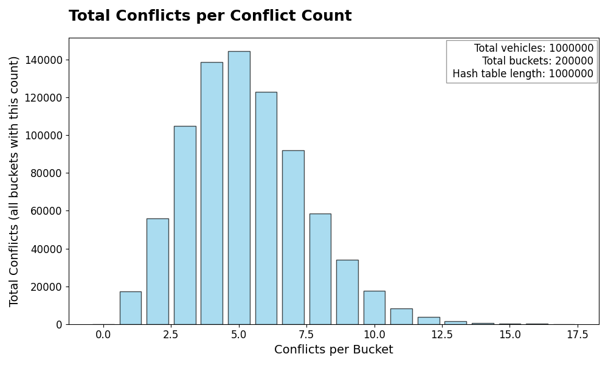

# Uppgift 2 - 1DV018

We are tasked with implementing different tasks. This is the second assignment for the course 1DV018 at Linnaeus University.

## Requirements

- Python 3.8 or higher
- Matplotlib

## How to run

1. Start by downloading all the requirements:

```bash
pip install -r requirements.txt
```

2. Run the project:

```bash
python main.py
```

3. To generate the graphs for task 5, run: ***(Optional)***

```bash
python MatPlot.py
```

## Analysis and Conclusions in Swedish

### För och nackdelar med Länkade listor jämfört med ArrayList

#### Fördelar med Länkade listor

- Dynamisk storlek - Ingen förutbestämd storlek behövs
- Snabbare insättning - om vi sätter in i mitten av listan behöver vi bara ändra pekare
- Tar inte upp samma mängd minne i förväg

#### Nackdelar med Länkade listor

- Långsammare sökning - vi måste iterera genom listan för att hitta ett element
- Tar upp mer minne per element, då varje element behöver en pekare till nästa element

#### Fördelar med ArrayList

- Snabbare sökning - vi kan direkt komma åt element med hjälp av index
- Bättre om vi har en "fast" storlek eller om vi sällan ändrar storlek
- Tar upp mindre minne per element då vi inte behöver pekare

#### Nackdelar med ArrayList

- "Fast" storlek. Ska vi ändra storlek måste vi skapa en ny array och kopiera över alla element
- Långsammare insättning - Om vi måste sätta in i mitten av listan måste alla element efter den positionen flyttas
- Tar upp mer minne i förväg - ArrayList allokerar mer minne än vad som behövs för att minska antalet gånger den behöver ändra storlek

#### Slutsats

Båda strukturerna har sina för- och nackdelar. I praktiken vet vi ofta ungefär hur stor listan kommer att bli, och då är en ArrayList ofta det bättre valet. Nackdelen är att en ArrayList måste växa genom omallokering och kopiering, vilket kan vara kostsamt. Här har länkade listor en fördel eftersom de inte behöver reservera minne i förväg.

Den största nackdelen med länkade listor är att det tar längre tid att hitta ett element, eftersom man måste iterera genom listan. I en ArrayList kan vi däremot direkt komma åt ett element via dess index, vilket ger så kallad *instant access*. Men vet vi att vi ofta kommer att iterera genom hela listan, till exempel för att skriva ut alla element, är skillnaden i söktid inte lika stor.

En annan styrka hos länkade listor är insättningar och borttagningar: när vi väl är på rätt plats behöver vi bara ändra pekarna för två element. I en ArrayList måste däremot alla efterföljande element flyttas, vilket gör operationen långsammare. Samtidigt hur ofta lägger vi egentligen till eller tar bort element i mitten av en lista i praktiken?

### Test Uppgift 2

Alla test går igenom utan problem. Vi testar både `size` och `is_empty` metoderna i vår `Task2.py` fil. Samt kastar vi undantag när vi försöker ta bort element från en tom lista.

Vill du se koden för testerna så finns den i `/test/Test_Task2.py`.

### Uppgift 3 - Binärt sökträd

Metoden för att radera de `k` element heter `special_operation`. Den tar in ett värde på `k` och raderar de `k` största elementen i trädet.
Om `k` är större än antalet element i trädet kastas ett undantag.
Vi går igenom trädet med hjälp utav `in_order` metoden som returnerar en sorterad lista med alla element i trädet. Vi tar sedan de sista `k` elementen i listan och raderar dem med hjälp av `remove` metoden.

### Uppgift 5 - Analys



För att genomföra detta experiment har jag först skapat en klass ``Vehicle`` som implementerar en hashfunktion och genererar ett unikt registreringsnummer. Registreringsnumret är en sträng som följer de nya reglerna för svenska registreringsskyltar (tre bokstäver följt av två siffror och en bokstav).

Därefter genererade jag 1 000 000 fordon och lade in dem i en hashtabell, vars storlek bestämdes enligt tumregeln ``n/5``. I detta fall innebär det att tabellen hade 200 000 positioner. Under processen räknade jag antalet konflikter som uppstod när fordonen placerades i tabellen.

Vad kan vi förvänta oss? Med 1 000 000 fordon och en tabellstorlek på 200 000 innebär det att varje position i genomsnitt bör innehålla ungefär 5 fordon (1 000 000 / 200 000 = 5).

Resultatet bekräftar denna förväntning. I grafen ser vi att de flesta positioner i tabellen innehåller mellan 3 och 6 fordon, med en tydlig topp vid 5 fordon. Detta överensstämmer väl med den teoretiska fördelningen. Utifrån detta kan vi dra slutsatsen att vår hashfunktion fungerar bra. Den fördelar registreringsnumren jämnt över tabellen och ger det jämna mönster av konflikter som vi hade förväntat oss.